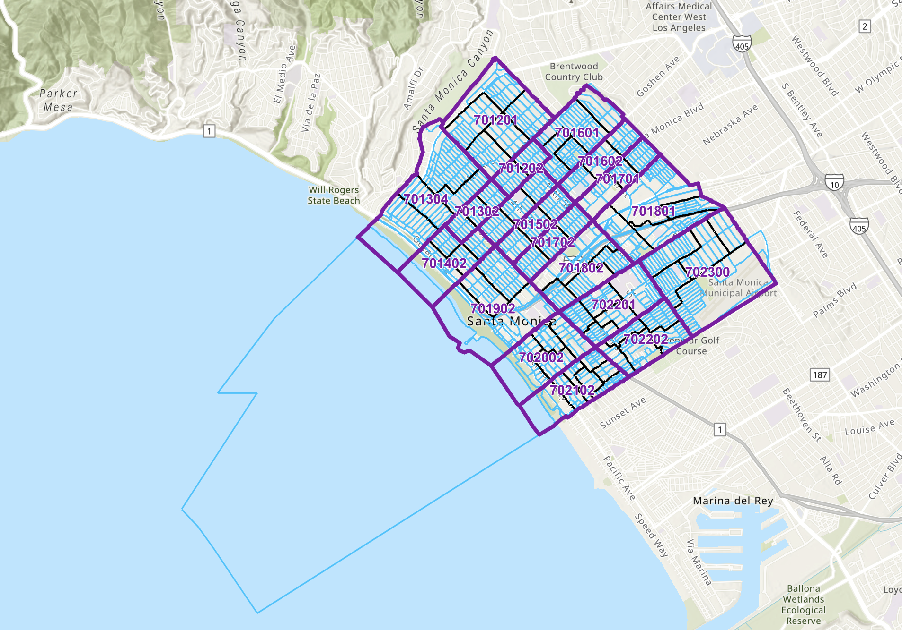
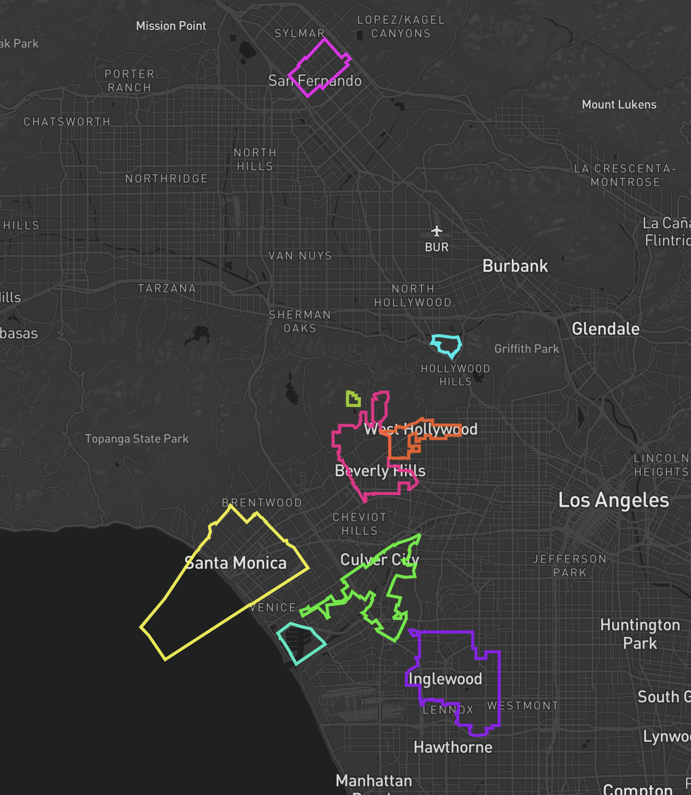
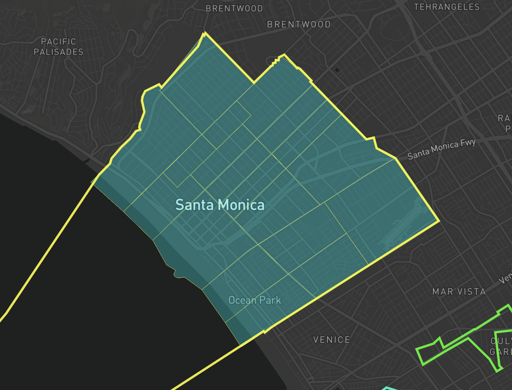
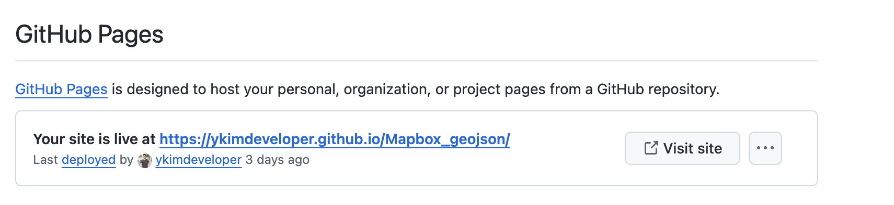
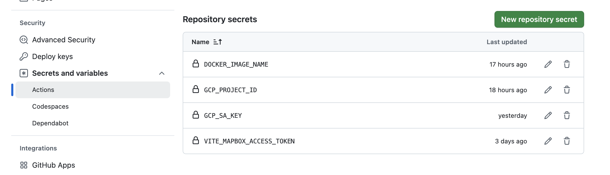
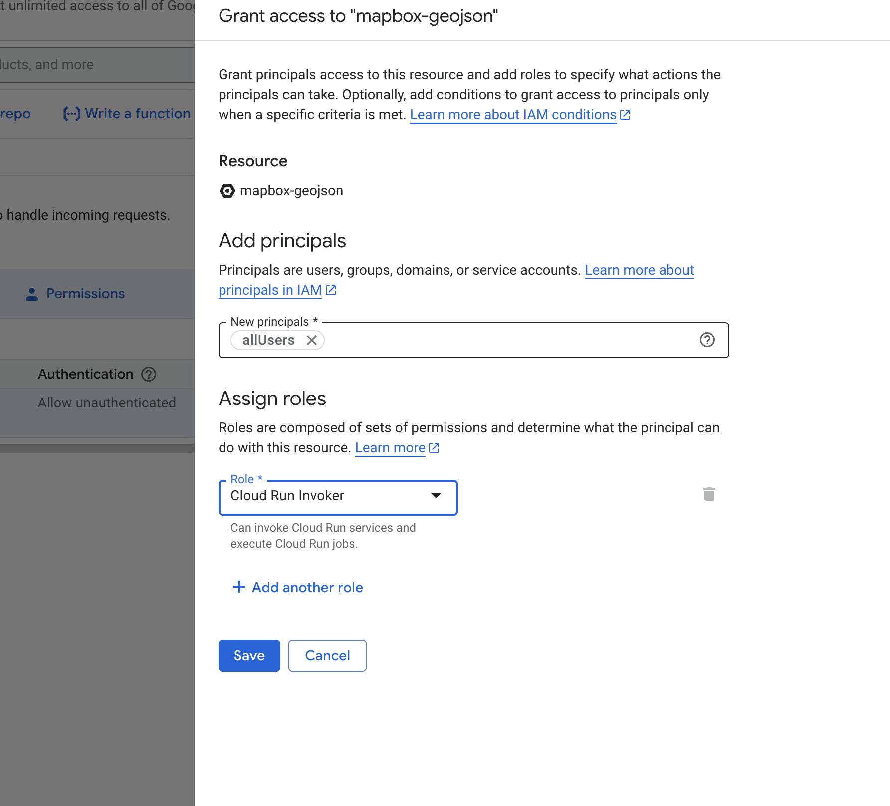
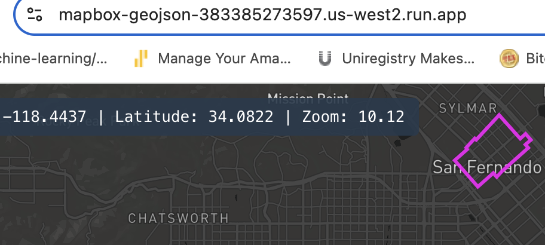

## Table of Contents

- [How to Get Geo Location](#-how-to-get-geo-location)
- [GeoJSON Files](#geojson-files)
- [How to Run the App](#how-to-run-the-app)
  - [project files](#project-files)
- [CI/CD Development gh-pages \& Cloud Run to Google Cloud](#cicd-development-gh-pages--cloud-run-to-google-cloud)
  - [Deploying to GitHub Pages](#deploying-to-github-pages)
  - [Deploying using GitHub Actions to Google Cloud](#deploying-using-github-actions-to-google-cloud)

## How to Get Geo Location

- Extract geolocation and boundary data using OpenStreetMap and Overpass Turbo.

  - OpenStreetMap
    https://nominatim.openstreetmap.org/search.php?q=Beverly+Hills,+Los+Angeles,+California&polygon_geojson=1&format=json

  ```Md
  Structure:
     q=: Specifies the search query, "Beverly Hills, Los Angeles, California."

     polygon_geojson=1: Requests the boundary geometry in GeoJSON format, if available.

     format=json: Specifies the output format as JSON for easier parsing.
  ```

  - Overpass Turbo
    https://overpass-turbo.eu

  ```
        [out:json][timeout:25];
        // Search for an area based on the state or province
        area["name"="California"]->.state;

        // Search for the city boundary within the specified state
        (
        relation(area.state)["boundary"="administrative"]["name"="Santa Monica"]["admin_level"="8"];
        );
        out geom;
  ```

  - State/Province: area["name"="California"]->.state; scopes the search to California.
  - City: "name"="Santa Monica" filters for Santa Monica's boundary.
  - Admin Level: admin_level=8 targets city boundaries; adjust to admin_level=6 for counties or others.
  - Boundary Output: out geom; retrieves full geometry of the boundaries.
- Run query & Export results in GeoJSON format for mapping.

Santa Monica boundaries goes into the ocean
https://www.openstreetmap.org/relation/3353288


ArcGis has 3 boundaries at Santa Monica
https://www.arcgis.com/apps/mapviewer/index.html?layers=78251bbda6214e348cb9cf304bbcac98
https://gisdata.santamonica.gov/maps/78251bbda6214e348cb9cf304bbcac98/about



## GeoJSON Files

You can find the GeoJSON files in the [public/data_geojson directory](https://github.com/ykimdeveloper/Mapbox_geojson/tree/main/public/data_geojson).

- [X] Incorporated Cities:
  - [X] West Hollywood
  - [X] Beverly Hills
  - [X] Culver City
  - [X] Santa Monica
  - [X] Universal City
  - [X] San Fernando
  - [X] Inglewood
- [ ] Unincorporated
  - [X] Marina Del Ray
  - [ ] Unincorporated LA Southwest of Culver City (this includes View Park-Windsor Hills, Ladera Heights, and oil fields)
  - [ ] Federal Land (VA Campus)
  - [X] Franklin Canyon (weird square above Beverly Hills)

## How to Run the App

```bash
 npm run dev
 
  VITE v6.2.2  ready in 577 ms

  ➜  Local:   http://localhost:5173/
  ➜  Network: http://192.168.4.145:5173/
  ➜  press h + enter to show help
```





* maybe clean up the bounaries in santa monica?

App.js Main component that displays the map, sidebar with coordinates, and a reset button. It uses the custom hook to initialize and control the Mapbox map.

src/hooks/useMapbox.js Custom hook that creates and manages the Mapbox map instance, updates state on movement, and loads GeoJSON county layers on map load.

src/utils/countySources.js Utility that exports addCountyLayer, a function to fetch local GeoJSON, optionally wrap it as a Feature, and add it to the map with neon styling.

### project files

```Md
project-root/
  ├─ public/
  │   └─ data_geojson/
  │       ├─ bev_hills/
  │       │   └─ bev_hills_openstreetmap.geojson
  │       └─ culver_city/
  │           └─ culver_city_openstreetmap.geojson
  └─ src/
      ├─ hooks/
      │   └─ useMapbox.js
      └─ utils/
          └─ countySources.js
```

## CI/CD Development gh-pages & Cloud Run to Google Cloud

### Deploying to GitHub Pages

1. Update Vite Config: Change the base in vite.config.js to match your repo name

```Md
// For GitHub Pages, if your repository is named "Mapbox_geojson":
export default defineConfig({
  base: '/Mapbox_geojson/',
  plugins: [react()],
})

```

2. Production Build: Run npm run build to generate static files in the dist/ folder.
3. Deploy to GitHub Pages

   ```
   npm run build
   npm install --save-dev gh-pages
   ```

   package.json:

   ```
        "scripts": {
        "build": "vite build",
        "deploy": "gh-pages -d dist"
      }
   ```
4. Your app will then be available at https://<username>.github.io/my-app/

   ```npm run build
      npm run deploy
   ```

   
5. Add secrets
   

### Deploying using GitHub Actions to Google Cloud




